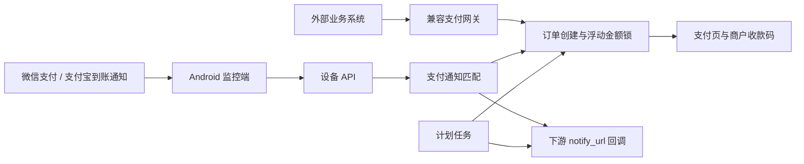

# VanillaPay

[](https://github.com/Lorikein12138/VanillaPay/actions/workflows/ci.yml)
[](https://github.com/Lorikein12138/VanillaPay/releases/latest)

VanillaPay 是一个面向商户自部署场景的支付订单与到账通知匹配系统。网站端负责订单、收款码、设备、回调和运营管理；Android 监控端运行在商户自有设备上，读取微信支付与支付宝到账通知，并将解析结果安全上报给网站端。

该项目适合已有聚合支付调用方、希望自行托管订单与通知匹配链路的团队。它依赖支付应用在 Android 系统中产生的通知，不替代微信支付或支付宝的官方商户接口。

## 核心能力

- 商户注册、登录、凭据管理和邮件验证码流程。
- 微信支付、支付宝收款二维码上传与启停管理。
- EPay、CodePay、YuanPay 风格的兼容网关入口。
- 基于浮动金额锁的并发同价订单区分。
- Android 通知监听、金额解析、本地去重和离线重试。
- 设备绑定、签名校验、防重放、心跳和解析规则同步。
- 支付结果匹配、下游 `notify_url` 回调和失败重试。
- 订单过期、设备离线检查、每日对账和风险事件记录。
- 商户控制台与 `/console` 运营控制台。

## 系统流程



端到端过程：

1. 商户注册并配置网关凭据、浮动金额策略和收款二维码。
2. 商户在网站端创建设备，使用二维码或绑定字符串绑定 Android 客户端。
3. 外部系统通过兼容网关创建订单，网站端为订单锁定一个实际支付金额。
4. 用户扫码付款，支付应用在 Android 设备上产生到账通知。
5. Android 客户端解析金额并提交到 `/app/push`。
6. 网站端按商户、渠道、金额和有效期匹配待支付订单。
7. 匹配成功后释放金额锁，并按网关协议向 `notify_url` 发送签名回调。
8. 计划任务处理订单过期、设备状态、回调重试和对账。

## 仓库结构

```text
VanillaPay/
├── website/   ThinkPHP 网站、商户控制台、设备 API 和支付网关
├── android/   Kotlin Android 通知监控客户端
├── docs/      项目级补充文档目录
└── .github/   GitHub Actions 工作流
```

组件文档：

- [网站端开发与部署](website/README.md)
- [Android 监控端构建与运维](android/README.md)

## 技术栈

| 组件 | 主要技术 | 配置来源 |
| --- | --- | --- |
| 网站端 | ThinkPHP、PHP、MySQL、Tailwind CSS | `website/composer.json`、`website/composer.lock`、`website/package.json` |
| Android 端 | Kotlin、AndroidX、Room、WorkManager、OkHttp | `android/app/build.gradle.kts`、`android/gradle/libs.versions.toml`、Gradle Wrapper |
| 持续集成 | GitHub Actions、PHPUnit、JUnit | `.github/workflows/ci.yml` |

正式安装包及其版本信息以 [GitHub Releases](https://github.com/Lorikein12138/VanillaPay/releases/latest) 为准。

## 快速开始

克隆仓库：

```bash
git clone https://github.com/Lorikein12138/VanillaPay.git
cd VanillaPay
```

### 网站端

```bash
cd website
composer install
npm install
cp .example.env .env
npm run build:css
php think migrate:run
php think run -p 8080
```

浏览器访问 `http://127.0.0.1:8080`。首次运行前需要创建 MySQL 数据库，并在 `website/.env` 中填写连接信息。

运行网站测试：

```bash
cd website
vendor/bin/phpunit
```

### Android 端

按照 Android 构建配置准备 JDK 与 Android SDK，在 `android/local.properties` 中配置 SDK 路径，然后运行：

```powershell
cd android
.\gradlew.bat :app:testDebugUnitTest
.\gradlew.bat :app:assembleDebug
```

调试 APK 输出到：

```text
android/app/build/outputs/apk/debug/app-debug.apk
```

## 配置边界

网站端运行配置存放在 `website/.env`，Android 发布签名配置存放在 `android/signing.properties` 或对应环境变量中。以下内容属于环境数据，应留在部署环境：

- 数据库账号、`APP_KEY`、SMTP 凭据和网关密钥。
- 设备 ID、设备密钥和绑定二维码。
- Android keystore、签名密码和证书固定配置。
- 上传的收款二维码、运行日志、数据库备份和构建产物。

示例配置只提供字段结构。生产环境应使用独立强密钥、HTTPS 和最小目录权限。

## 测试与合并

GitHub Actions 在面向 `master` 的 Pull Request 上运行：

- `website-tests`：按工作流配置安装 PHP 依赖并执行 PHPUnit。
- `android-tests`：按工作流配置安装 JDK 与 Android SDK，并执行 JVM 单元测试。

仓库仅允许 Squash merge，`master` 要求签名提交。PR 标题作为最终 commit 标题，PR 正文作为 commit 正文。提交前应保证标题描述单一变更，正文说明行为变化、测试结果和版本影响。

本地完整验证命令：

```powershell
cd website
vendor\bin\phpunit

cd ..\android
.\gradlew.bat :app:testDebugUnitTest
.\gradlew.bat :app:assembleDebug :app:assembleRelease
```

## 发布概览

网站和 Android 端是强耦合组件。涉及设备 API、签名参数、解析规则或安装包的变更，应同步验证两端契约。

网站发布流程：

1. 运行网站测试。
2. 执行 `website/pack-deploy.bat` 生成部署归档。
3. 在目标服务器保留 `.env`、上传目录和运行时数据后部署。
4. 执行迁移、清理缓存、验证路由和计划任务。

Android 发布流程：

1. 更新 `versionCode` 和 `versionName`。
2. 运行 Android 测试并构建 Debug、Release 两个变体。
3. 将签名后的 Release APK 发布到网站下载目录和 GitHub Releases。
4. 比较构建产物、网站下载文件和生产文件的 SHA256。

完整步骤分别记录在组件 README 中。

## 生产检查

- Web 文档根目录指向 `website/public`。
- `runtime` 与 `public/static/uploads` 具备所需写权限。
- Nginx 或其他 Web 服务器已配置入口重写和上传目录脚本禁用规则。
- SMTP 已配置，注册和密码重置邮件可送达。
- Android 设备已授予通知访问、前台通知、忽略电池优化和自启动权限。
- 订单过期、设备检查、回调重试任务按分钟运行，每日对账按日运行。
- 使用测试订单验证创建、支付、匹配、回调和过期全链路。

## 安全说明

- 所有生产入口使用 HTTPS；Android 绑定地址只接受 HTTPS。
- 设备请求使用 HMAC-SHA256 签名和时间戳窗口校验。
- 回调目标经过 URL 校验，敏感接口带有限流或 CSRF 防护。
- 支付金额统一经过金额支持类转换，以分为核心计算单位。
- Android 设备凭据保存在加密 SharedPreferences 中。
- 设备丢失、换绑或凭据泄露时，应立即轮换设备密钥。
- 上线前应评估目标 ROM 对通知监听、后台运行和自启动的限制。

## 项目许可

本仓库当前未声明独立的项目级开源许可证，使用与分发范围由项目所有者另行授予。`website/LICENSE.txt` 是 ThinkPHP 上游许可说明，第三方依赖继续适用各自许可证。
