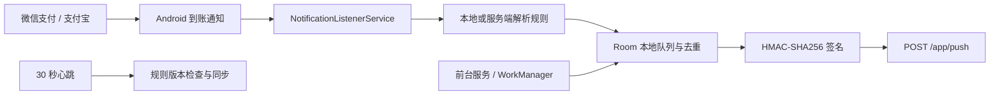

# VanillaPay Android 监控端

VanillaPay Android 监控端运行在商户自有设备上，负责监听微信支付与支付宝到账通知、解析金额、缓存离线记录，并将结果安全上报给 VanillaPay 网站端。应用同时维护设备心跳、同步服务端解析规则，并提供权限检查、运行诊断和日志导出能力。

- 项目总览：[../README.md](../README.md)
- 网站端开发与部署：[../website/README.md](../website/README.md)
- 最新安装包：[GitHub Releases](https://github.com/Lorikein12138/VanillaPay/releases/latest)

应用版本、最低系统要求和目标 SDK 以 `app/build.gradle.kts` 为准。

## 职责范围

- 通过二维码扫描或绑定字符串连接商户设备。
- 引导并检查通知访问、电池优化和厂商自启动设置。
- 监听微信支付与支付宝应用产生的到账通知。
- 从标题、正文、展开文本、摘要、文本行和 ticker 等字段提取通知内容。
- 按内置或服务端规则识别渠道与金额。
- 使用本地哈希和网站端幂等键避免重复上报造成重复结算。
- 使用 Room 保存待上报、失败和已发送记录。
- 在前台服务中维持监听状态，并每 30 秒发送设备心跳。
- 使用 WorkManager 定期唤醒离线队列重试。
- 展示近期上报、设备状态和诊断信息，并支持导出应用日志。

应用只读取 Android 系统已发布的通知，不登录支付账号，也不替代微信支付或支付宝的官方商户接口。支付应用版本、通知开关和厂商后台策略都会影响通知是否可见。

## 运行流程



1. 应用解析网站端生成的 HTTPS 绑定数据，并将设备凭据保存到加密配置中。
2. 权限向导确认通知访问、电池优化白名单和自启动设置。
3. `PaymentListenerService` 只处理微信与支付宝包名的通知，并收集所有可用文本字段。
4. `NotificationParser` 按当前规则识别收款关键词和金额；未识别的支付应用通知写入诊断日志。
5. 解析结果先写入 Room，通过通知包名、原始文本和通知时间生成的 SHA256 哈希去重。
6. `Reporter` 对请求参数签名后提交到 `/app/push`。网络失败或未匹配记录按退避策略保留重试。
7. `KeepAliveService` 每 30 秒调用 `/app/heart`，同步服务器时间并根据规则版本刷新 `/app/config`。
8. WorkManager 每 15 分钟执行一次兜底重试，设备重启后由启动接收器恢复服务。

## 技术基线

| 项目 | 说明或配置来源 |
| --- | --- |
| 语言与 Java 工具链 | Kotlin；具体工具链见 `app/build.gradle.kts` |
| Gradle | 使用仓库自带 Wrapper，版本见 `gradle/wrapper/gradle-wrapper.properties` |
| Android 插件与依赖 | 版本集中在 `gradle/libs.versions.toml` |
| Android SDK | `compileSdk`、`targetSdk` 和 `minSdk` 见 `app/build.gradle.kts` |
| 本地存储 | Room、EncryptedSharedPreferences |
| 后台任务 | 前台 Service、WorkManager |
| 网络 | OkHttp、HTTPS、可选证书固定 |
| 测试 | JUnit JVM 单元测试 |

构建机需要安装项目所配置的 Android SDK Platform 及对应构建工具。Gradle Wrapper 已随仓库提供，不需要单独安装 Gradle。

## 目录结构

```text
android/
├── app/
│   ├── build.gradle.kts       应用版本、签名和构建变体
│   ├── proguard-rules.pro     Release 混淆与保留规则
│   └── src/
│       ├── main/              Kotlin 源码、Manifest 和资源
│       └── test/              JVM 单元测试
├── gradle/
│   ├── libs.versions.toml     插件与依赖版本目录
│   └── wrapper/               Gradle Wrapper 元数据
├── build.gradle.kts           根项目插件配置
└── settings.gradle.kts        仓库与模块配置
```

主要源码包位于 `app/src/main/java/com/vanillapay/monitor/`：

| 包 | 职责 |
| --- | --- |
| `bind/` | 绑定字符串校验与解析 |
| `config/` | 加密设备配置和解析规则存储 |
| `data/` | Room 数据库、实体与 DAO |
| `net/` | API 客户端、签名、请求构建、证书固定和退避策略 |
| `parse/` | 通知规则、规则 JSON 和金额解析 |
| `permission/` | 通知访问、电池优化与厂商自启动检查 |
| `receiver/` | 开机后恢复监控服务 |
| `service/` | 通知监听、心跳、前台保活和上报队列 |
| `ui/` | 绑定、扫码、主页、设置、日志与诊断页面 |
| `util/` | 时钟同步、日志、崩溃记录和原始通知哈希 |
| `work/` | WorkManager 离线重试任务 |

## 开发环境

在 `android/` 目录创建 `local.properties` 并配置 Android SDK。该文件已受 Git 忽略。

Windows 示例：

```properties
sdk.dir=D:/Android/Sdk
```

macOS 或 Linux 示例：

```properties
sdk.dir=/opt/android-sdk
```

确认 Java 版本：

```powershell
java -version
.\gradlew.bat --version
```

项目通过 `jvmToolchain` 固定 Java 工具链。IDE 使用的 Gradle JDK 和终端中的 JDK 应与 `app/build.gradle.kts` 保持一致。

## 构建与安装

Windows：

```powershell
cd android
.\gradlew.bat :app:testDebugUnitTest
.\gradlew.bat :app:assembleDebug
.\gradlew.bat :app:installDebug
```

macOS 或 Linux：

```bash
cd android
./gradlew :app:testDebugUnitTest
./gradlew :app:assembleDebug
./gradlew :app:installDebug
```

Debug APK 输出位置：

```text
android/app/build/outputs/apk/debug/app-debug.apk
```

`installDebug` 需要已通过 USB 或无线调试连接的设备。可用以下命令确认连接状态：

```bash
adb devices
```

## 设备绑定

在网站端商户设备页面创建设备，然后扫描二维码或粘贴绑定字符串：

```text
serverUrl|deviceId|deviceKey
```

| 字段 | 说明 |
| --- | --- |
| `serverUrl` | VanillaPay 网站端公开地址，只接受带有效主机名的 HTTPS URL |
| `deviceId` | 网站端签发的正整数设备 ID |
| `deviceKey` | 设备专属签名密钥 |

应用会移除 `serverUrl` 末尾的 `/`。绑定数据属于敏感凭据，不应写入截图、工单、公共日志或仓库。设备丢失、换机或凭据外泄后，应在网站端换绑或轮换设备密钥。

## 权限与后台运行

应用以三个条件作为运行前置检查：

| 设置 | 用途 | 验证方式 |
| --- | --- | --- |
| 通知访问 | 接收支付应用发布的通知 | 系统“通知使用权”中启用 VanillaPay |
| 忽略电池优化 | 减少待机时前台服务被限制 | 系统电池优化列表中允许后台运行 |
| 自启动确认 | 设备重启后恢复监听 | 厂商系统管理页面开启并返回应用确认 |

在系统要求应用单独申请通知权限时，还应允许 VanillaPay 发送通知，以便常驻服务状态和异常提醒保持可见。扫码绑定时需要相机权限；也可以直接粘贴绑定字符串，应用不强制要求设备具备相机。

小米、华为、OPPO、vivo、三星、一加、魅族等系统可能还有独立的自启动、后台高耗电或休眠应用设置。量产使用前应在目标品牌、系统版本和支付应用版本上进行长时间真机验证。

常驻的“VanillaPay 监听运行中”通知表示前台服务仍在运行，但不单独证明通知访问权限有效。应用会周期检查常驻通知；通知消失时会提示检查后台运行和通知权限。

## 通知解析与规则同步

当前监听的支付应用包名：

```text
微信支付：com.tencent.mm
支付宝：  com.eg.android.AlipayGphone
```

监听服务会合并并去重以下通知内容：

- 标题与大标题。
- 普通正文与展开正文。
- 子文本、信息文本和摘要文本。
- Inbox 样式的多行文本。
- 旧版 ticker 文本。

解析器先按包名筛选支付应用，再要求通知内容包含收款语义关键词，并从规则定义的金额模式中提取数值。金额转换使用整数分，不使用浮点数参与上报。

应用内置基础规则，绑定后通过 `/app/config` 获取服务端规则。心跳响应中的规则版本变化会触发更新，因此常见通知格式调整可以由网站端下发，无需重新安装 APK。修改规则时应同时验证：

1. 正常到账通知能识别正确渠道和金额。
2. 普通聊天、红包、付款、退款等非到账通知不会误报。
3. 分组通知、展开通知和目标厂商系统上的字段组合可被提取。
4. 规则 JSON 异常时应用仍保留可用的默认或上一版规则。

支付应用通知未识别时，可使用以下命令查看监听诊断：

```bash
adb logcat -s VanillaPayListener
```

日志会包含支付应用包名以及应用实际读取到的标题和正文，适合用于调整通用规则。分享前应删除订单、金额之外的个人信息和设备凭据。

## 设备 API 与签名

```text
POST /app/heart    上报设备状态、应用版本并检查规则版本
POST /app/push     上报解析后的渠道、金额和幂等键
GET  /app/config   获取当前通知解析规则
```

每次请求按以下步骤生成签名：

1. 排除 `sign` 字段和空值字段。
2. 按字段名升序排序。
3. 将字段编码为 `name=value`，使用 `&` 连接。
4. 使用设备密钥计算 HMAC-SHA256。

请求包含 Unix 时间戳。应用根据心跳响应校准本地时间偏移，以减少设备时间不准确导致的签名过期。通知哈希作为 `trade_no_device` 提交，网站端还会进行幂等校验。

## 本地队列与重试

通知解析成功后先写入 Room，再立即尝试发送。失败记录按次数使用以下退避序列计算下一次允许发送的最早时间：

```text
5 秒、15 秒、30 秒、60 秒、120 秒、300 秒
```

超过序列长度后保持 300 秒间隔。新通知入队时会一并处理已经到期的记录，WorkManager 每 15 分钟提供一次系统级兜底唤醒；因此这些间隔不是保证准点执行的定时器。每轮最多按创建顺序处理 50 条记录。

本地清理规则：

- 已发送记录保留 7 天后删除。
- 失败次数达到 10 次且创建超过 24 小时的记录会被清理。
- 尚未达到清理条件的失败记录继续保留，应用或网络恢复后可再次发送。

网站端返回“已接收但尚未匹配订单”时，记录仍保持可重试状态，直到订单匹配成功或达到本地清理条件。

## 网络与本地安全

- Manifest 默认禁用明文 HTTP，绑定解析也只接受 HTTPS。
- 设备 URL、ID 和密钥保存在 `EncryptedSharedPreferences` 中。
- Android 备份与数据提取规则排除应用敏感数据。
- API 请求使用设备专属 HMAC-SHA256 签名。
- Release 构建启用代码压缩与资源收缩。
- 可选证书固定由构建字段 `BuildConfig.CERT_PIN_HOST` 和 `BuildConfig.CERT_PIN_SHA256` 控制。

证书固定值为空时，OkHttp 使用系统 HTTPS 信任存储。启用固定时，SHA256 字段填写证书公钥固定值的 Base64 主体，不包含 `sha256/` 前缀；客户端构建时会自动添加该前缀。证书轮换前必须先发布兼容新证书的 APK，否则旧客户端会失去连接。

## 诊断与日志

应用内提供状态、近期上报、诊断和日志页面。日志缓冲区最大为 256 KiB，轮转时保留一个备份文件，并可通过系统分享面板导出。

排查时建议记录：

- 应用版本和 Android 系统版本。
- 微信或支付宝版本。
- 通知访问、电池优化、自启动和应用通知状态。
- 最近心跳时间与网站端设备在线状态。
- 通知实际标题、正文和发生时间。
- `/app/heart`、`/app/config` 或 `/app/push` 的状态，不记录设备密钥与完整签名。

## 测试

运行 JVM 单元测试：

```powershell
cd android
.\gradlew.bat :app:testDebugUnitTest
```

测试覆盖绑定校验、金额转换、通知字段提取与解析、规则 JSON、请求签名、心跳 payload、时间同步、退避计划、队列保留、证书安全默认值和 Release 构建配置。

JVM 测试无法覆盖 Android 系统实际通知、厂商后台限制和支付应用版本差异。涉及通知监听、权限、保活或网络的变更还需要在真机上完成手工验证。

## Release 签名

Release 构建从 `android/signing.properties` 读取签名配置。该文件和 keystore 均受 Git 忽略，应保存在受控的发布环境中。

```properties
storeFile=release.keystore
storePassword=replace-with-store-password
keyAlias=release-key-alias
keyPassword=replace-with-key-password
```

也可以通过环境变量覆盖对应字段：

```powershell
$env:VP_KEYSTORE="D:\path\to\release.keystore"
$env:VP_STORE_PWD="store-password"
$env:VP_KEY_ALIAS="release-key-alias"
$env:VP_KEY_PWD="key-password"
```

构建脚本优先读取环境变量。Release 密钥必须持续备份；更换签名密钥后，已安装用户通常无法直接覆盖升级。

## 发布流程

任何 Android 代码或行为变更都应先按语义化版本更新 `app/build.gradle.kts` 中的 `versionName`，并递增 `versionCode`。仅修改文档时不需要更新应用版本。

1. 运行测试，并同时构建 Debug 与 Release APK：

```powershell
cd android
.\gradlew.bat :app:testDebugUnitTest
.\gradlew.bat :app:assembleDebug :app:assembleRelease
```

2. 将 Release APK 复制到网站下载目录：

```powershell
Copy-Item app/build/outputs/apk/release/app-release.apk ..\website\public\download\app-release.apk -Force
```

3. 验证两个本地文件一致：

```powershell
Get-FileHash app/build/outputs/apk/release/app-release.apk -Algorithm SHA256
Get-FileHash ..\website\public\download\app-release.apk -Algorithm SHA256
```

4. 通过完整网站部署，或单独同步 APK，将网站下载目录更新到目标服务器。
5. 比较本地 `website/public/download/app-release.apk` 与服务器下载文件的 SHA256，确认部署内容一致。
6. 在 `/devices` 页面实际下载安装包，检查版本、签名和覆盖安装行为。
7. 创建与版本号一致的 Git 标签和 GitHub Release，上传 APK 及对应的 `.sha256` 附件。

Release APK、SHA256 文件、keystore、签名配置和网站部署归档都属于构建或环境产物，不进入 Git。

## 真机发布检查

- 二维码扫描和绑定字符串粘贴均可完成绑定。
- 非 HTTPS、无效设备 ID 和空密钥会被拒绝。
- 通知访问、电池优化和自启动流程能正确显示状态。
- 微信支付与支付宝的真实到账通知均能解析正确金额。
- 普通消息、付款、退款和重复通知不会造成错误结算。
- `/app/heart` 每 30 秒正常更新，规则版本变化可自动同步。
- 离线记录在网络恢复后上报，重复提交由两端幂等处理。
- 熄屏、切换网络、清理最近任务和设备重启后监听可以恢复。
- 应用内日志与诊断信息可查看、导出，并且不暴露设备密钥。
- 网站 `/devices` 下载按钮和 GitHub Release 提供同一版本的签名 APK。

## 故障排查

### 收到支付通知但应用没有记录

1. 确认系统通知栏中确实出现微信支付或支付宝到账通知。
2. 确认 VanillaPay 的通知访问权限仍为开启状态。
3. 检查支付应用自身是否关闭了到账通知。
4. 在应用诊断页面查看监听服务和最近日志。
5. 使用 `adb logcat -s VanillaPayListener` 检查通知文本是否被识别。
6. 如果日志显示 `unrecognized`，根据实际通用格式调整网站端解析规则并触发同步。

### 应用有记录但网站没有收到

1. 确认应用已绑定且网站端设备处于启用状态。
2. 检查最近心跳是否成功，以及设备时间是否明显异常。
3. 确认服务器证书有效，绑定域名与证书固定主机一致。
4. 查看本地记录是等待、失败还是已发送状态。
5. 检查网站端 `/app/push` 日志、签名时间窗和设备限流结果。

### 心跳正常但订单没有匹配

1. 确认通知渠道和金额与订单的实际支付金额一致。
2. 确认设备与订单属于同一商户。
3. 确认订单仍为待支付且未超过有效期。
4. 检查网站端是否把推送返回为未匹配；该状态会在客户端继续重试。
5. 检查是否存在浮动金额配置或订单创建参数差异。

### 后台运行一段时间后停止监听

1. 保持常驻服务通知可见，不要禁用其通知渠道。
2. 重新检查电池优化白名单和厂商自启动设置。
3. 将 VanillaPay 从厂商“休眠应用”或“一键清理”名单中排除。
4. 验证锁屏、充电和断网恢复等场景，必要时更换更适合常驻运行的设备。

### Release 构建签名失败

确认 `signing.properties` 或四个 `VP_*` 环境变量完整，`storeFile` 指向存在的 keystore，并且 alias 与密码匹配。不要用新的临时密钥覆盖已有正式版本。

## 安全清单

- 只绑定受信任的 HTTPS 网站端，不允许用户绕过绑定校验。
- 每台设备使用独立凭据，丢失或退役时立即轮换。
- 不在源码、日志、截图、CI 输出或 Release 附件中泄露密钥。
- keystore 和密码分开保存，并维护可验证的离线备份。
- 启用证书固定前制定证书轮换和旧客户端升级方案。
- 发布前检查依赖、混淆配置、APK 签名、版本号和 SHA256。
- 定期使用两个支付渠道的当前正式版本执行真实设备回归测试。
