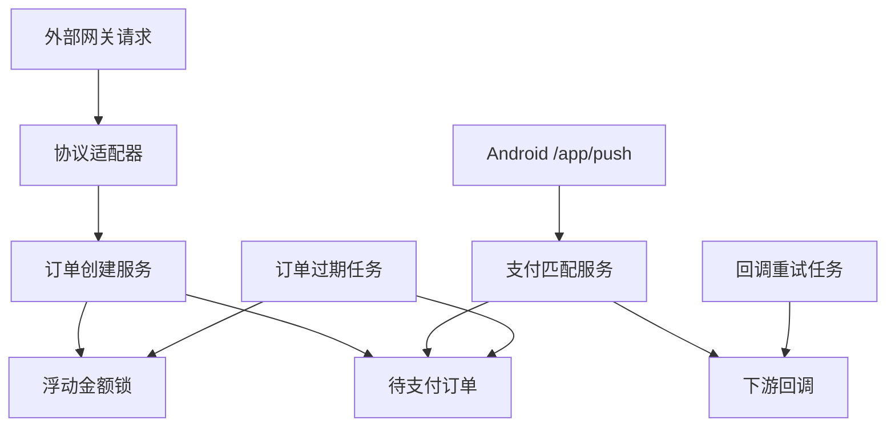

# VanillaPay 网站端

VanillaPay 网站端是基于 ThinkPHP 的服务端应用，负责商户与运营管理、收款二维码、兼容支付网关、订单生命周期、Android 设备接入、到账匹配和下游回调。

- 项目总览：[../README.md](../README.md)
- Android 监控端：[../android/README.md](../android/README.md)

## 职责范围

网站端提供以下能力：

- 商户注册、登录、邮件验证、密码重置和凭据管理。
- 微信支付、支付宝收款二维码上传、处理和启停。
- 商户设备创建、换绑、状态查询和 APK 下载入口。
- EPay、CodePay、YuanPay 风格的订单创建与查询接口。
- 订单实际金额分配、金额锁、超时释放和手工补单。
- Android 心跳、通知上报和解析规则下发接口。
- 按商户、渠道、金额和有效期匹配支付通知。
- 按协议生成签名回调、记录响应并进行退避重试。
- 商户仪表盘、订单列表和 `/console` 运营控制台。
- 风险事件、操作日志、登录日志和每日对账摘要。

## 请求链路



## 技术基线

- PHP、ThinkPHP、Composer 依赖和 PHPUnit 约束以 `composer.json` 与 `composer.lock` 为准。
- 数据库使用 MySQL 或行为兼容的数据库，并采用 `utf8mb4` 字符集。
- Node.js 仅用于 Tailwind CSS 构建，依赖约束以 `package.json` 与锁文件为准。
- CI 运行时以 `.github/workflows/ci.yml` 为准。

安装依赖后可运行以下命令检查当前环境是否满足 PHP 及扩展要求：

```bash
composer check-platform-reqs
```

建议启用的 PHP 扩展：

```text
pdo_mysql
mbstring
openssl
curl
fileinfo
gd
zip
opcache
```

运行 PHPUnit 还可能需要 `dom`、`xml` 和 `xmlwriter`。

## 目录结构

```text
website/
├── app/
│   ├── command/      计划任务和管理员命令
│   ├── common/       领域服务、协议、仓储接口、DTO 和支持类
│   ├── console/      运营控制台
│   ├── device/       Android 设备 API
│   ├── gateway/      兼容支付网关
│   ├── index/        商户端页面与控制器
│   ├── middleware/   HTTPS、安全头、限流和 CSRF 中间件
│   └── provider.php  接口与实现的容器绑定
├── config/           ThinkPHP 与应用配置
├── database/         数据库迁移
├── public/           Web 文档根目录、静态资源、上传和 APK 下载
├── route/            路由定义
├── tests/            PHPUnit 测试
├── view/             服务端渲染模板
├── deploy-server.sh  服务器端更新脚本
└── pack-deploy.bat   Windows 部署包生成脚本
```

运行时目录：

```text
runtime/                  框架缓存、日志和临时文件
public/static/uploads/    商户上传的二维码及处理结果
public/download/          Android Release APK 下载目录
```

`runtime` 和 `public/static/uploads` 需要由 Web 进程写入。环境文件、上传内容、运行日志和 APK 构建产物均不进入 Git。

## 架构约定

### 领域服务

核心业务位于 `app/common/service/`：

- `GatewayOrderCreator`：将不同网关参数转换为统一订单输入。
- `OrderCreationService`：校验订单、分配实际金额并建立金额锁。
- `FloatAmountAllocator`：按商户策略生成可用金额候选。
- `PaymentMatcher`：将设备通知原子匹配到有效待支付订单。
- `CallbackSender`：构建协议回调、发送请求并记录结果。
- `OrderExpirationService`：过期订单并释放金额锁。
- `OrderSupplementService`：处理商户手工补单。
- `DeviceProvisionService`：签发设备 ID、设备密钥和绑定数据。
- `ReconciliationService`：生成按日订单与风险汇总。

控制器只负责 HTTP 输入输出和权限边界。已有仓储接口时，业务代码通过 `app/common/repository/*Interface.php` 访问持久化层；实现绑定集中在 `app/provider.php`。

### 金额

业务金额统一经过 `app/common/support/Money.php`，领域逻辑以整数分处理。订单表中的展示金额由支持类在字符串金额与整数分之间转换，避免控制器或服务直接进行浮点金额运算。

### 网关协议

协议适配器实现 `PayProtocolAdapter`，并由 `AdapterRegistry` 注册。新增协议时应完成：

1. 实现请求解析、签名校验、回调参数和成功响应文本。
2. 在注册表中注册适配器。
3. 添加显式路由。
4. 覆盖创建、查询、回调和异常场景测试。

### 数据库

迁移位于 `database/migrations/`。ThinkPHP 会自动应用 `DB_PREFIX`，迁移和查询使用逻辑表名。每个迁移时间戳保持唯一，并同时验证全新数据库与已有数据库升级路径。

## 环境配置

复制示例文件：

```bash
cp .example.env .env
```

Windows PowerShell：

```powershell
Copy-Item .example.env .env
```

基础配置：

```ini
APP_DEBUG = false
APP_ENV = production
APP_KEY = replace-with-a-long-random-secret

DB_DRIVER = mysql
DB_TYPE = mysql
DB_HOST = 127.0.0.1
DB_NAME = vanillapay
DB_USER = vanillapay
DB_PASS = replace-with-a-strong-password
DB_PORT = 3306
DB_CHARSET = utf8mb4
DB_PREFIX = vp_

DEFAULT_LANG = zh-cn
```

配置原则：

- 本地开发可启用 `APP_DEBUG`，生产环境保持关闭。
- 每个环境使用独立 `APP_KEY`、数据库账号和密码。
- 数据库账号只授予目标数据库所需权限。
- `.env` 仅保存在运行环境，不随部署包覆盖。
- SMTP 参数由运营控制台写入设置表，不放入仓库。

## 本地开发

安装 PHP 与前端依赖：

```bash
composer install
npm install
```

创建数据库并配置 `.env` 后运行迁移：

```bash
php think migrate:run
```

构建 CSS：

```bash
npm run build:css
```

启动开发服务器：

```bash
php think run -p 8080
```

查看显式路由：

```bash
php think route:list
```

默认访问地址：

```text
http://127.0.0.1:8080
```

## 路由与入口

项目启用了 `url_route_must`，所有公开入口应在 `route/` 中显式声明。

| 路由文件 | 职责 | 典型入口 |
| --- | --- | --- |
| `route/index.php` | 商户注册、登录、仪表盘、订单、二维码和设备 | `/login`、`/dashboard`、`/orders`、`/devices` |
| `route/gateway.php` | 兼容网关、支付页和订单状态 | `/submit.php`、`/mapi.php`、`/pay/<order_no>` |
| `route/app.php` | 聚合商户、网关和设备路由 | `/app/heart`、`/app/push`、`/app/config` |
| `route/console.php` | 运营控制台 | `/console/login`、`/console/dashboard` |

`route/app.php` 会引入 `index.php` 和 `gateway.php`。调整聚合入口前，应运行 `php think route:list` 检查重复路由与遗漏。

## 商户与运营配置

### 首个运营管理员

部署完成后创建首个管理员：

```bash
php think vanilla:admin-create admin_user strong_password
```

登录入口：

```text
/console/login
```

该命令用于初始化。后续商户、通道和系统设置通过运营控制台维护。

### SMTP

注册和密码重置依赖邮件验证码。开放注册前，在 `/console/settings` 配置：

- SMTP 主机与端口。
- 加密方式（TLS、SSL 或关闭传输加密）。
- SMTP 用户名和密码。
- 发件邮箱与显示名称。

完成后使用可接收邮件的测试地址验证注册与密码重置流程。

### 商户接入流程

1. 访问 `/register` 完成邮件验证和注册。
2. 登录后在凭据页面获取 PID 与 API Key。
3. 在 `/qrcodes` 分别上传微信支付和支付宝收款二维码。
4. 在浮动金额页面配置方向、步长、上限和订单超时。
5. 在 `/devices` 创建设备并下载 Android 应用。
6. 用绑定二维码或绑定字符串连接监控端。
7. 使用订单测试页或外部网关客户端验证支付流程。

## 网关接口

兼容入口：

```text
EPay:    /submit.php, /mapi.php, /api.php
CodePay: /creat_order/
YuanPay: /yuanpay/submit, /yuanpay/mapi
```

协议适配器负责各方言的字段映射和签名规则，领域层统一处理订单。外部客户端应使用部署后的 HTTPS 域名，例如：

```text
https://pay.example.com/submit.php
```

回调和返回地址要求：

- `notify_url` 必须是可公开访问的 HTTP 或 HTTPS 地址，并通过内网地址校验。
- `return_url` 使用 HTTPS。
- 下游只有返回协议规定的成功文本才视为回调成功。
- 回调失败会记录 HTTP 状态、响应正文、次数和下次重试时间。

接口参数与示例以商户登录后的 `/docs` 页面为准，避免在公开文档中复制环境凭据。

## Android 设备 API

```text
POST /app/heart    上报设备心跳、应用版本并获取规则版本
POST /app/push     上报已解析的支付通知
GET  /app/config   获取通知解析规则
```

绑定字符串格式：

```text
serverUrl|deviceId|deviceKey
```

设备签名算法：

1. 去除 `sign` 和空值字段。
2. 按字段名升序排序。
3. 以 `name=value` 形式使用 `&` 连接。
4. 使用设备密钥计算 HMAC-SHA256。

设备请求带 Unix 时间戳，服务端默认校验 300 秒时间窗口。设备路由按设备维度限流；`trade_no_device` 用于幂等识别重复通知。

修改字段、签名、状态码或解析规则版本时，需要同步 Android 客户端并增加两端契约测试。

## 计划任务

建议每分钟运行：

```bash
/path/to/php /path/to/site/think vanilla:order-expire
/path/to/php /path/to/site/think vanilla:device-check
/path/to/php /path/to/site/think vanilla:callback-retry
```

建议每天运行一次：

```bash
/path/to/php /path/to/site/think vanilla:reconcile-daily
```

| 命令 | 作用 |
| --- | --- |
| `vanilla:order-expire` | 将超时待支付订单设为过期并释放金额锁 |
| `vanilla:device-check` | 将心跳超时设备标记为离线并记录风险事件 |
| `vanilla:callback-retry` | 重试满足条件的失败下游回调 |
| `vanilla:reconcile-daily` | 输出前一日支付、待支付、过期和风险摘要 |

计划任务应使用与 Web 运行时一致的 PHP 版本，并将标准输出和错误输出接入服务器日志。

## 测试

运行完整 PHPUnit 套件：

```bash
vendor/bin/phpunit
```

Windows：

```powershell
vendor\bin\phpunit
```

运行单个文件：

```bash
vendor/bin/phpunit tests/Unit/PaymentMatcherTest.php
```

运行单个测试：

```bash
vendor/bin/phpunit --filter testMethodName tests/Unit/PaymentMatcherTest.php
```

测试覆盖领域服务、协议入口、签名与防重放、限流、迁移前缀、安全默认值、页面模板和部署脚本。涉及数据库或框架集成的改动，还应在临时数据库上执行迁移和端到端验证。

## 构建部署包

Windows 上执行：

```bat
cd website
pack-deploy.bat
```

输出文件：

```text
website/deploy/vanillapay-website-YYYYMMDD-HHMMSS.zip
```

部署包包含应用代码、配置、迁移、公共资源、路由、视图、Composer 锁文件和部署脚本，并排除：

```text
.env
vendor/
node_modules/
runtime/
tests/
deploy/
public/static/src/
```

`public/download/app-release.apk` 会随 `public/` 进入部署包，但该 APK 受 Git 忽略。打包前应确认它与当前 Android Release 构建一致。

## 生产部署

### 首次部署

1. 上传并解压部署包到站点目录。
2. 将 Web 文档根目录设置为站点的 `public`。
3. 从 `.example.env` 创建 `.env` 并填写生产配置。
4. 创建数据库并确认数据库账号权限。
5. 运行：

```bash
cd /path/to/site
bash deploy-server.sh
```

指定 PHP 或 Composer：

```bash
PHP_BIN=/path/to/php COMPOSER_BIN=/path/to/composer bash deploy-server.sh
```

脚本会执行：

- 创建运行时与上传目录。
- 安装生产 Composer 依赖。
- 运行数据库迁移。
- 清理 ThinkPHP 缓存。
- 验证路由加载。
- 在存在 `www` 用户时调整目录所有者。

### Nginx 示例

```nginx
location / {
    if (!-e $request_filename) {
        rewrite ^(.*)$ /index.php?s=/$1 last;
        break;
    }
}

location ~ ^/static/uploads/.*\.php$ {
    deny all;
}
```

同时建议限制 `.env`、日志、备份和隐藏文件访问，并由 HTTPS 站点统一处理外部请求。

### 更新已有部署

1. 备份数据库、`.env` 和上传目录。
2. 运行测试并生成新的部署包。
3. 解压覆盖应用文件，保留环境文件和运行时数据。
4. 再次执行 `deploy-server.sh`。
5. 检查迁移、路由、首页、登录、计划任务和错误日志。

如果旧数据库已有业务表但缺少迁移记录，备份后执行一次：

```bash
PHP_BIN=/path/to/php bash deploy-baseline-existing-db.sh
bash deploy-server.sh
```

基线脚本只为连续存在的初始表写入迁移记录，用于把早期数据库纳入迁移管理。

## 部署后验证

基础验证：

```bash
php think route:list
curl -I https://pay.example.com/login
curl -I https://pay.example.com/download/app-release.apk
```

业务验证：

1. 创建测试商户并确认邮件送达。
2. 上传两个渠道的测试二维码。
3. 绑定 Android 设备并确认心跳变为在线。
4. 创建小额测试订单并检查实际金额。
5. 触发到账通知并确认订单状态变为已支付。
6. 检查回调请求、响应和重试状态。
7. 创建短超时订单并确认计划任务释放金额锁。

## 故障排查

### Composer 报告 `putenv() has been disabled`

确认 CLI 与 Web 使用同一 PHP 安装，并检查 CLI 的 `disable_functions`：

```bash
/path/to/php /path/to/composer install --no-dev --optimize-autoloader
```

### `zip.so` 加载失败

为当前 PHP 版本安装 zip 扩展，或移除指向不存在扩展文件的配置，再重启 PHP-FPM。

### 缺少 `migrate` 命令

重新安装 Composer 依赖，并确认 `topthink/think-migration` 存在：

```bash
/path/to/php /path/to/composer install --no-dev --optimize-autoloader
```

### `Duplicate migration`

检查 `database/migrations` 中的时间戳。每个版本只保留一个迁移，并在修正后重新运行迁移。

### 二维码上传后返回 404

确认 Web 文档根目录是 `public`，文件真实存在且 Web 用户可读：

```bash
chmod -R 755 public/static/uploads
```

### 二维码页面没有更新

检查 `gd`、`fileinfo` 和上传目录写权限，并查看 `runtime/log`。

### Android 心跳正常但订单未匹配

依次检查：

1. 设备所属商户与订单所属商户是否一致。
2. 通知渠道和金额是否与订单实际金额一致。
3. 订单是否仍在有效期内。
4. `/app/push` 响应中的 `matched` 和状态码。
5. Android 日志中是否存在解析或网络错误。

### 回调持续失败

检查目标 URL 的公网可达性、HTTPS 证书、响应状态和响应文本。目标系统需要返回对应协议规定的成功文本。

## 安全清单

- 生产环境关闭调试模式并使用独立强 `APP_KEY`。
- 数据库、SMTP、网关和设备密钥按环境隔离并定期轮换。
- Web 根目录只暴露 `public`，限制上传目录脚本执行。
- 对外入口启用 HTTPS、安全响应头、限流和日志监控。
- 保留数据库与上传目录备份，并定期验证恢复流程。
- 更新依赖前审查锁文件变化并运行完整测试。
- 日志中隐藏密码、API Key、设备密钥和完整签名参数。
